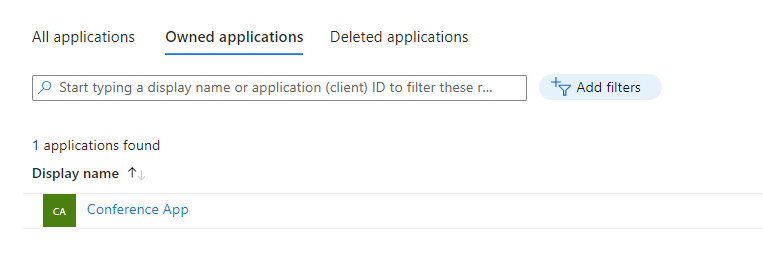

[comment]: <> (please keep all comment items at the top of the markdown file)
[comment]: <> (please do not change the ***, as well as <div> placeholders for Note and Tip layout)
[comment]: <> (please keep the ### 1. and 2. titles as is for consistency across all demoguides)
[comment]: <> (section 1 provides a bullet list of resources + clarifying screenshots of the key resources details)
[comment]: <> (section 2 provides summarized step-by-step instructions on what to demo)


[comment]: <> (this is the section for the Note: item; please do not make any changes here)
***
### Azure API Management with Conference demo API - OAuth

<div style="background: lightgreen; 
            font-size: 14px; 
            color: black;
            padding: 5px; 
            border: 1px solid lightgray; 
            margin: 5px;">

**Note:** This demo is a continuation of the base scenario. For the initial instructions, see the [Base Demo Guide](https://github.com/petender/azd-apimwithconfAPI/blob/main/demoguide/apimwithconference.md).
</div>

### Introduction

This demo extends the base Conference API scenario by demonstrating how to secure API operations in Azure API Management (APIM) using OAuth 2.0 and Azure Active Directory (Entra ID). The primary goal is to show how to protect sensitive API endpoints—such as the GetSpeakers operation of the Mtt Demo Conference API—by applying the validate-azure-ad-token policy. This ensures that only requests with a valid OAuth token issued by Entra ID can access protected operations. By the end of this demo, you will understand how to integrate Azure AD authentication with APIM to enhance the security of APIs.


### 1. What Resources are getting deployed
This scenario builds on the base deployment and includes all previously created resources, plus an additional Application registration in Entra ID named **'Conference App'**.

**Resources created:**
- Azure Resource Group
- Azure API Management Resource
- Conference Demo API (published API)


<br></br>

**New in this scenario:**
- Entra ID Application Registration (OAuth Client)


<br></br>

### 2. Demonstration Steps

1. After deployment, review the terminal output. You will see instructions similar to the following, which guide you through obtaining an OAuth token using the Entra ID application registration:

   ```powershell
   # (Example output)
   📋 To get an access token for this API, use the following commands:

   # Login with the API scope:
   az login --scope api://<application guid>>/.default
    
   # Get access token:
   az account get-access-token --resource api://<aplication guid>
   ```

   Follow these instructions to obtain a valid token for testing the secured API operation.


1. (optional) User a tool like https://jwt.ms/ to decode the token and verify its contents, it should have a scope 'API.Invoke'.

1. Open the Azure Portal and navigate to your API Management instance.
1. In the left-hand menu, select **APIs** and then choose the **Conference Demo API**.
1. Show the **Operations** tab and select the **GetSpeakers** operation and display the Inbound Processing policies. You should see the `validate-azure-ad-token` policy applied, which secures this operation.

   ```xml
   <inbound>
       <base />
        <validate-azure-ad-token tenant-id="ffffffff-9999-4444-aaaa-aaaaaaaaaaaa">
            <audiences>
                <audience>api://b7f2a8c3-4e2b-4c1a-9f3e-2d8e5a1b7c44</audience>
            </audiences>
            <required-claims>
                <claim name="scp" match="any">
                    <value>API.Invoke</value>
                </claim>
            </required-claims>
        </validate-azure-ad-token>
   </inbound>
   ```
1. Switch to the **Test** tab and select the **GetSpeakers** operation.
1. (optional) invoke the operation without a token to demonstrate that it fails with a 401 Unauthorized error.
1. Click the *Add Headers* button and add the following header:

   - name: `Authorization`
   - value: `Bearer <your_access_token>`

1. Invoke the **GetSpeakers** operation with the Authorization header containing the valid OAuth token you obtained earlier.

[comment]: <> (this is the closing section of the demo steps. Please do not change anything here to keep the layout consistant with the other demoguides.)
<br></br>
***
<div style="background: lightgray; 
            font-size: 14px; 
            color: black;
            padding: 5px; 
            border: 1px solid lightgray; 
            margin: 5px;">

**Note:** This is the end of the current demo guide instructions.
</div>


